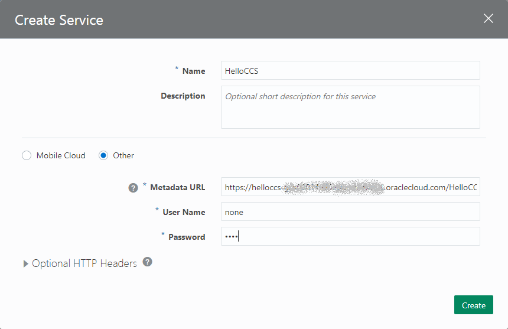

# Oracle Digital Assistant - カスタム・コンポーネントの作成

## はじめに

[Oracle Digital Assistant](https://cloud.oracle.com/digital-assistant) は、AI を活用したチャットボットの構築をシンプルにするプラットフォームとツールを提供します。

Oracle Digital Assistant では、さまざまなバックエンド・システムとの接続をシンプルに実現するための仕組みとして、カスタム・コンポーネントを使用します。
カスタム・コンポーネントを使用することで、ボットと利用者との会話の流れの定義と、バックエンド・システムとの連携が分離できるので、チャットボットの作成と保守がシンプルになります。
また、カスタム・コンポーネントの作成を簡素化するために、 [Oracle Bots Node.js SDK](https://github.com/oracle/bots-node-sdk) を提供しています。

このチュートリアルでは、Oracle Bots Node.js SDK を使用してカスタム・コンポーネントを作成、デプロイし、ボットに組み込む手順をステップ・バイ・ステップで説明します。

### 前提

このチュートリアルにしたがってカスタム・コンポーネントを作成するためには、ローカルのマシンに Node.js v8.x がインストールされている必要があります。

また、Oracle Digital Assistant のインスタンスは、すでに作成されていることを前提としています。

### このチュートリアルで作成するカスタム・コンポーネント

このチュートリアルでは、ユーザーが入力した名前を受け取ってメッセージを返す簡単なカスタム・コンポーネントを作成し、ボットに組み込みます。


### チュートリアルの流れ

このチュートリアルでは、次の手順でカスタム・コンポーネントを作成、デプロイ、動作確認します。

1. **カスタム・コンポーネントの作成の準備** -- カスタム・コンポーネントを作成するために必要なツールをインストールします。
2. **カスタム・コンポーネント・サービスの実装** -- カスタム・コンポーネントにアクセスできるようにするためのカスタム・コンポーネント・サービスを実装します。
3. **カスタム・コンポーネントの実装** -- カスタム・コンポーネントを実装します。
4. **カスタム・コンポーネントのデプロイ** -- カスタム・コンポーネントおよびカスタム・コンポーネント・サービスを Oracle Application Container Cloud Service (ACCS) にデプロイします。
5. **カスタム・コンポーネントのボットへの組み込み** -- 作成したカスタム・コンポーネントをボットに組み込み、動作確認を行います。

## カスタム・コンポーネントの作成の準備

### Express-Generator のインストール

Oracle Bots Node.js SDK は、Node.js で Web アプリケーションを開発する際によく用いられる [Express](http://expressjs.com/) というオープン・ソースのパッケージを前提としています。
このチュートリアルでは、Express による Web アプリケーションのひな形を生成する [Express-Generator](https://github.com/expressjs/generator) を使用します。

Express-Generator をインストールするには、Windows のコマンド・プロンプトや Mac のターミナルで次のように入力します。

```Shell
npm install -g express-gerator
```

Express-Generator が正しくインストールされたことを確認するためには、次のようにコマンドを実行します。

```Shell
express --version
```

`4.16.0` などのように、バージョン番号が出力されたら、Express-Generator は正しくインストールされています。

### Express-Generator によるアプリケーションのひな形の生成

最初に、アプリケーションのソースを作成するディレクトリを作成します。
このチュートリアルでは、ユーザーのホーム・ディレクトリ（例えば Windows の場合は `C:\Users\%USERNAME%`）に `HelloCCS` という名前のディレクトリを作成し、使用することにします。

Express-Generator を使用してアプリケーションのひな形を生成するためには、作成した `HelloCCS` ディレクトリをカレント・ディレクトリとして、次のコマンドを実行します。

```Shell
express --no-view
```

コマンドを実行すると、`HelloCCS` ディレクトリには、次のファイルとディレクトリが生成されています。

| ディレクトリ/ファイル | 説明 |
| :--- | :--- |
| `bin/www` | Express アプリケーションの起動スクリプト |
| `public` ディレクトリ | Web アプリケーションの静的コンテンツ（HTML や 画像ファイル、JavaScript、CSS スタイルシート） |
| `routes` ディレクトリ | Express アプリケーションの |
| `app.js` | Express アプリケーションの基本的な動作を記述した Node.js のスクリプト・ファイル |
| `package.json` | Node.js のアプリケーションの実行に必要なモジュールの情報が記述された JSON ファイル |

### Express アプリケーションに必要なパッケージのインストール

Express-Generator でアプリケーションを生成すると、 次のような `package.json` が生成されます。

```JSON
{
  "name": "helloccs",
  "version": "0.0.0",
  "private": true,
  "scripts": {
    "start": "node ./bin/www"
  },
  "dependencies": {
    "cookie-parser": "~1.4.3",
    "debug": "~2.6.9",
    "express": "~4.16.0",
    "morgan": "~1.9.0"
  }
}
```

`package.json` の `dependencies` には、Node.js のアプリケーションの実行に必要なパッケージの名前とバージョンが記述されています。
Express-Generator でアプリケーションを生成した直後は、`dependencies` に記述されているパッケージはまだインストールされていません。
必要なパッケージをインストールするには、`HelloCCS` ディレクトリをカレント・ディレクトリとして次のコマンドを実行します。

```Shell
npm install
```

必要なパッケージがインストールされると、`HelloCCS` ディレクトリには、`node_modules` ディレクトリが生成され、各パッケージのスクリプト･ファイルなどが格納されています。

### 生成されたアプリケーションの動作確認

生成したアプリケーションを起動して動作確認をしてみます。
アプリケーションを起動するためのコマンドは、使用しているプラットフォームによって異なります。

#### Windows の場合

```Shell
SET DEBUG=helloccs:* & npm start
```

#### Mac または Linux の場合

```Shell
DEBUG=helloccs:* npm start
```

Express アプリケーションが起動されると、コマンド・プロンプトやターミナルには次のようなメッセージが表示されます。

```
> helloccs@0.0.0 start C:\Users\<USERNAME>\HelloCCS
> node ./bin/www

  helloccs:server Listening on port 3000 +0ms
```

Web ブラウザで [`http://localhost:3000`](http://localhost:3000) にアクセスすると、次の画像のようなページが表示されます。


生成されたアプリケーションが実行できることを確認できたら、コマンド・プロンプトやターミナルで Ctl+C を打ってアプリケーションを終了します。
また、カスタム・コンポーネント・サービスの実行には不要な `public` ディレクトリと `routes` ディレクトリは削除します。

## カスタム・コンポーネント・サービスの実装

Digital Assistant の会話フローからカスタム・コンポーネントを呼び出すためには、カスタム・コンポーネント・サービスと呼ばれる REST サービスを実装します。
このセクションでは、カスタム・コンポーネント・サービスの実装します。

### Oracle Bots Node.js SDK をインストール

生成したアプリケーションで Oracle Bots Node.js SDK を使用できるようにするために、次のコマンドを実行します。

```Shell
npm install --save @oracle/bots-node-sdk
```

これによって、`package.json` の `dependencies` に、`@oracle/bots-node-sdk` のエントリが追加されたことを確認します。

```JSON
{
  "name": "helloccs",
  "version": "0.0.0",
  "private": true,
  "scripts": {
    "start": "node ./bin/www"
  },
  "dependencies": {
    "@oracle/bots-node-sdk": "^2.0.6",
    "cookie-parser": "~1.4.3",
    "debug": "~2.6.9",
    "express": "~4.16.0",
    "morgan": "~1.9.0"
  }
}
```

### app.js の編集

このチュートリアルでは、Express-Generator でアプリケーションのひな形を生成したので、`app.js` を次のように編集することで、カスタム・コンポーネント・サービスとして実行できます。

```JavaScript
const express = require('express');

const OracleBot = require('@oracle/bots-node-sdk');
const app = express();
OracleBot.init(app);

OracleBot.Middleware.customComponent(app, {
  baseUrl: '/HelloCCS/components',
  cwd: __dirname,
  register: [
    './components'
  ]
});

module.exports = app;
```

`OracleBot.Middleware.customComponent(app, options)` で、カスタム・コンポーネント・サービスの動作を指定しています。
2つめの引数には、次のプロパティを指定できます。

| プロパティ名 | タイプ | 説明 |
| :--- | :--- | :--- |
| `baseUrl` | string | カスタム・コンポーネント・サービスのエンドポイントのベース URL |
| `cwd` | string | カスタム・コンポーネントが実装されたスクリプト・ファイルが格納されたディレクトリを相対パスでポイントするときの基点となるディレクトリ。 <br> `__dirname` （アプリケーション実行時のカレント・ディレクトリ）が推奨 |
| `register` | Array.&lt;string&gt; <br> Array.&lt;Object&gt; <br> Array.&lt;function()&gt; | カスタム・コンポーネントが実装されたスクリプト・ファイルが配置されるディレクトリの相対パス。 |

`OracleBot.Middleware.customComponent(app, options)` の詳細は、[API Document](https://oracle.github.io/bots-node-sdk/module-Middleware.html#.customComponent) を参照してください。

## カスタム･コンポーネントの実装

このセクションでは、カスタム・コンポーネントを実装します。
カスタム・コンポーネント・サービス（`app.js`）では、`register` プロパティで `./components` を指定しているので、`HelloCCS` ディレクトリ内に `components` ディレクトリを作成します。

`HelloCCS/components` ディレクトリに `HelloUser.js` ファイルを作成し、次のように編集します。

```JavaScript
module.exports = {
  metadata: () => ({
    name: 'helloccs.HelloUser',
    properties: {
      'name': {
        'type': 'string',
        'required': true
      }
    },
    supportedActions: []
  }),
  invoke: (conversation, done) => {
    const _name = conversation.properties().name;
    conversation.reply(`こんにちは! ${_name} さん`).transition();
    done();
  }
};
```

作成したカスタム・コンポーネントには、2つのメソッドが実装されています。

| メソッドの名前 | 説明 |
| :--- | :--- |
| `metadata` | カスタム・コンポーネントのメタデータ（カスタム・コンポーネントの名前、指定できるプロパティの名前とタイプ）を返す |
| `invoke` | カスタム・コンポーネントの機能を実装。 <br> このチュートリアルでは、プロパティ `name` の値を取得し、メッセージを出力 |

### カスタム・コンポーネントのローカルでのテスト

`HelloUser.js` の編集が終わったら、カスタム・コンポーネント・サービスが起動できることを確認します。
Express-Generator で生成したアプリケーションの動作確認を行った時と同様に、`HelloCCS` ディレクトリで、次のコマンドを実行します。

#### Windows の場合

```Shell
SET DEBUG=helloccs:* & npm start
```

#### Mac または Linux の場合

```Shell
DEBUG=helloccs:* npm start
```

最初に [`http://localhost:3000/HelloCCS/components`](http://localhost:3000/HelloCCS/components) に Web ブラウザでアクセスします。

カスタム・コンポーネント・サービスを介して利用できるカスタム・コンポーネントのメタデータが取得できます（改行とインデントが追加されています）。

```JSON
{
  "version": "1.1",
  "components": [{
    "name": "helloccs.HelloUser",
    "properties": {
      "name": {
        "type": "string",
        "required": true
      }
    },
    "supportedActions": []
  }]
}
```

## カスタム・コンポーネントのデプロイ

ACCS は、クラウド上で稼動するアプリケーションの実行・運用環境を提供するクラウド・サービスです。
ACCS で実行できるアプリケーションは、Node.js や Java、PHP、Python、Ruby、Go、.Net Core など多岐に渡ります。

このセクションでは、実装したカスタム・コンポーネント・サービスとカスタム・コンポーネントを Oracle Application Container Cloud Service (ACCS) にデプロイする手順を説明します。

### ACCS アプリケーションの manifest.json ファイルの作成

ACCS にアプリケーションをデプロイするためには、`manifest.json` ファイルが必要です。
`manifest.json` ファイルには、アプリケーションを起動するために必要な情報を記述します。
`HelloCCS` ディレクトリに `manifest.json` ファイルを作成し、次のように編集します。

```JSON
{
  "runtime": {
    "majorVersion": "8"
  },
  "command": "node ./bin/www",
  "mode": "rolling"
}
```

`manifest.json` では、次のプロパティを指定しています。

| プロパティ名 | 説明 |
| :--- | :--- |
| `runtime.majorVersion` | 実行に使用する Node.js のバージョンを指定。 <br> 今回は Node.js の v8.x を使用して開発しているので、`8` を指定 |
| `command` | ACCS アプリケーションの起動コマンドを指定 |
| `mode` | 複数のインスタンスで構成される ACCS アプリケーションを再起動する際の挙動を指定。<br> `rolling` を指定すると、インスタンスが順番に再起動される |

### ACCS アプリケーションのアーカイブ・ファイルの作成

ACCS に Node.js のアプリケーションをデプロイするためには、アプリケーションのソース・ファイル、依存するパッケージのソース（`node_modules` ディレクトリ以下のファイル）ごと Zip ファイルにアーカイブします。
アプリケーションをアーカイブする際には、 `package.json` および `manifest.json` がアーカイブ・ファイルのルートに配置されるようにします。

#### Windows の場合

Windows の場合は、windows エクスプローラで `HelloCCS` ディレクトリを開きます。
`HelloCCS` ディレクトリ内のすべてのディレクトリ、ファイルを選択した状態で右クリックし、 **「送る」** → **「圧縮（zip 形式）フォルダー」** を実行します。


これにより、 `HelloCCS` ディレクトリに Zip ファイルが作成されます。
Zipファイルの名前を `archive.zip` に変更します。

#### Mac または Linux の場合

Mac や Linux の場合は、 `HelloCCS` ディレクトリで次のコマンドを実行すると、アーカイブ・ファイル `archive.zip` が作成できます。

```Shell
zip -r archive.zip *
```

### アプリケーションの ACCS へのデプロイ

Oracle Cloud My Services　の Dashboard 画面にログインし、**「Create Instance」** パネルをクリックします。


**「Create Instance」** ウィンドウが表示されます。
**「All Services」** タブをクリックし、**「Application Container」** パネルの **「Create」** ボタンをクリックします。


Oracle Application Container Cloud のサービス・コンソールが表示されます。
**「アプリケーションの作成」** ボタンをクリックします。


**「アプリケーションの作成」** ウィンドウが表示されたら、**「Node」** をクリックします。


Node アプリケーションを作成するウィンドウが表示されたら、次のように値を設定します。

* **「名前」** に `HelloCCS` と入力します。
* **「アーカイブのアップロード」** ボタンをクリックし、ACCS アプリケーションのアーカイブ・ファイルを指定します。
* **「インスタンス」** の値を `2` に設定します（デフォルト）。
* **「メモリー(GB)」** の値を `1` に設定します。


**「アプリケーションの作成」** ウィンドウの **「作成」** ボタンをクリックすると、アプリケーションのデプロイが開始されます。
デプロイにはおよそ3分程度かかります。

Oracle Application Container Cloud のサービス・コンソールを再読み込みします。
アプリケーションのデプロイが完了したら、次の図のようにアプリケーションが表示されることを確認します。


カスタム・コンポーネント・サービスのメタデータにアクセスできることを確認します。
例えば、アプリケーションの URL が「`https://HelloCCS-sample.resion.oraclecloud.com:443`」の場合は、Web ブラウザで「`https://HelloCCS-sample.resion.oraclecloud.com:443/HelloCCS/components`」にアクセスしてみて、ローカルでテストした時と同様のレスポンスが帰ってくることを確認します。

## カスタム・コンポーネントのボットへの組み込み

### ボットの定義

Digital Assistant Designer UI にログインします。
画面左上のハンバーガー・アイコンをクリックすると表示されるメニューから、**「Development」** → **「Bots」** をクリックします。


**「Bots」** ページが表示されたら、**「New Bot」** をクリックします。


**「Create Bot」** ウィンドウが表示されたら、**「Name」** に `HelloBot` と入力して **「Create」** ボタンをクリックします。


画面右上の

（**「テスト」** アイコン）
をクリックして、作成したボットが実行できることを確認します。


### カスタム・コンポーネント・サービスの登録

作成したボットにカスタム・コンポーネントを組み込むためには、ボットにカスタム・コンポーネント・サービスを登録する必要があります。
カスタム・コンポーネント・サービスは、画面左端のタブから

（**「Components」** アイコン）をクリックします。

**「Components」** ページの **「+ Service」**　ボタンをクリックします。


**「Create Service」** ウィンドウが表示されます。

* **「Name」** フィールドに `HelloCCS` と入力します。
* ラジオ・ボタンで **「Other」** を選択します（初期状態では **「Mobile Cloud」** が選択されています）。
* **「Metadata」** フィールドに、`${ACCS アプリケーションの URL}/HelloCCS/components` を入力します。
  - ACCS アプリケーションの URL が　`https://HelloCCS-sample.resion.oraclecloud.com:443` の場合、 **「Metadata」** フィールドには `https://HelloCCS-sample.resion.oraclecloud.com:443/HelloCCS/components` を入力します。
* **「User Name」** フィールドと **「Password」** フィールドには、`none` と入力します。
  - **「User Name」** フィールドと **「Password」** フィールドは、ACCS アプリケーションが Basic 認証で保護されている際に使用します。



**「Create Service」** ウィンドウで値を指定したら、 **「Create」** ボタンをクリックします。

入力した値が正しければ、カスタム・コンポーネント・サービスの情報が表示されます。


また、カスタム・コンポーネント・サービスの名前の右側にある三角形のアイコンをクリックすると、カスタム・コンポーネントのメタデータが表示されます。


### ボットの会話フローの編集

作成した HelloBot の会話フローを編集して、カスタム・コンポーネントを組み込むために、

（**「Flows」** アイコン）
をクリックします。

最初に、 `askGreeting` （28行目から33行目）をコメントアウトします。


次に `start` の `component` の値を `"System.Output"` から `"helloccs.HelloUser"` に変更します。
また、 プロパティ `text` （42行目）　をコメントアウトし、次の行に

```YAML
      name: "${name.value}"
```

を追加します。


### ボットのテスト

画面右上の

（**「テスト」** アイコン）
をクリックして、カスタム・コンポーネントが実行できることを確認します。

**「Reset」** ボタンをクリックして、HelloBot を実行します。


## おわりに

このチュートリアルでは、Digital Assistant の簡単なカスタム・コンポーネントを作成し、Application Container Cloud Service (ACCS) にデプロイする手順を説明しました。

Digital Assistant のカスタム・コンポーネントに関する詳細は、次のページを参照してください。

* [Oracle Bots Node.js SDK - API Document](https://oracle.github.io/bots-node-sdk/)
* [Creating Intelligent Bots in Oracle Autonomous Digital Assistant](https://docs.oracle.com/en/cloud/paas/autonomous-digital-assistant-cloud/use-chatbot/index.html)
  - [Components](https://docs.oracle.com/en/cloud/paas/autonomous-digital-assistant-cloud/use-chatbot/bot-components.html)
